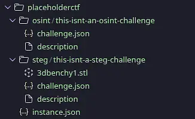
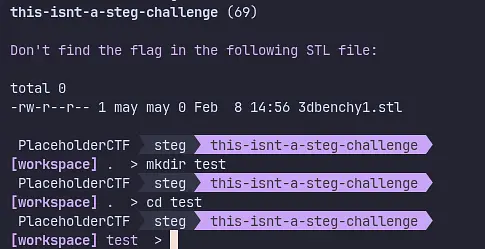
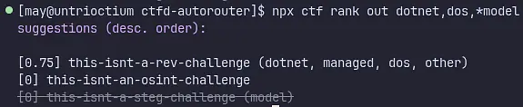

[](https://www.npmjs.com/package/ctfd-autorouter) 

`ctfd-autorouter` is a userbot for [CTFd](//github.com/CTFd/CTFd) to download jeopardy CTF challenges and group challenges based on their attributes (to improve team efficiency). It also has features for workspaces, preservation, and downloading challenge/instance info and attachments.

My aim for this project is to allow my CTF team to preserve challenges for our write-ups and to easily assign challenges to each member to save us time.

*Rating or reviewing this project for Flavortown? [See here](DEMO.md) for instructions on how to set up a CTFd instance!*

# Usage

### [Demo Video](https://user-cdn.hackclub-assets.com/019c4277-6bfe-76e6-b474-718e4c161169/demo.webm)

## Requirements

- [Node.js](//nodejs.org) ≥ 24
- NPM
- A Linux distribution with bash installed

## Installation and Basic Commands

Install the package with `npm i -g ctfd-autorouter` and run `npx ctf login` to log into a CTFd server. `npx ctf info` can be used to verify instance info and check information about the current CTFd account. Check the [features](#features) for more commands.

# Features

## Basic Challenge Searching and Attachment Downloads

**NOTE:** This program has only been tested with User Mode, which most likely has a few differences relating to the "solved" status of challenges. Thus, `npx ctf challenges` may not accurately show whether your team solved a challenge in Team Mode.

To open a list of all the challenges in a CTFd instance, run `npx ctf challenges`.

To open challenge information, you can run `npx ctf challenge <name>`. Note that `<name>` can be a substring!

Along with the challenge information are **attachment codes**. These are a two number colon-separated symbol which represent a file attachment. These codes can be used with `npx ctf download <code>`.

## CTF Preservation

To preserve a CTF, run `npx ctf preserve <out_directory>` to preserve all challenges to that domain. You'll end up with a nice directory tree with all the challenges laid out for future write-ups.



## Workspaces

`ctfd-autorouter` also has "workspaces" which allow for the creation of a clean directory with challenge attachments *quickly*.

You can quickly make a workspace with all your challenge information by running `npx ctf workspace <challenge name>`.



Workspaces are stored at `~/ctfd-workspaces/<ctf>/<category>/<challenge>`:

```
/home/may/ctfd-workspaces/
└── placeholderctf
    ├── osint
    │   └── this-isnt-an-osint-challenge
    └── steg
        └── this-isnt-a-steg-challenge
            └── 3dbenchy1.stl
```

## Ranking

One of the main features in this program is the ability to perform heuristics on CTF challenges. To view a file's heuristic "tags", run `npx ctf heur <path>`.


Otherwise, you can rank an entire CTF using a [preserved folder](#ctf-preservation). Run `npx ctf rank <preservation path> <tags>`, with `<tags>` substituted with a comma-separated list of heuristic tags. You can cross out any challenges with specific tags by prefixing any unwanted tags with asterisk (*). Tags are also prioritised by the order they're given (beginning to end)



Here are some example tag lists:
- `dotnet,managed,unmanaged,source,binary,*graphic` - Prefer .NET and managed assemblies over binaries and source code, while blocking challenges with images.
- `graphic,shell,*dotnet,*java` - Prefer images and shell scripts over .NET and Java programs.

### Available tags
- `dotnet` - Compiled MSIL programs (.exe, .dll) [C#, F#]
- `java` - Java Classes (.class)
- `elf` - ELF File format (used in *nix systems)
- `dos` - .exe files (both DOS and peexe)
- `managed` - managed assemblies (.exe, .dll, .class)
- `unmanaged` - unmanaged assemblies (.exe, .dll, .elf)
- `model` - 3D models (e.g. .obj, .stl, .fbx)
- `cad` - CAD files (e.g .f3d, .scad)
- `source` - Source Files
- `shell` - Shell Scripts (.sh, .zsh, .fish)
- `graphic` - Graphics (PNG, JPEG, SVG)
- `image` - Disk Images (.iso, .img)
- `archive` - Archives (TAR, XZ, GZip, LZMA, BZip, 7Zip)
- `other` - Other filetypes

# Credits

- [Catppuccin](https://catppuccin.com/)'s colour scheme (Mocha)